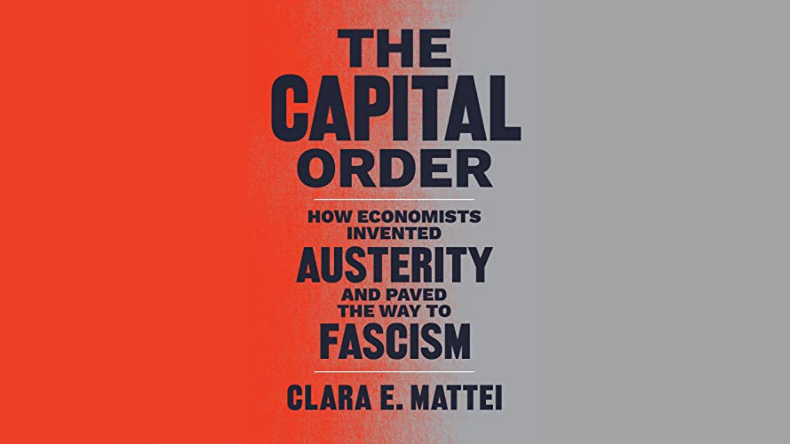

*Note: This review was first published on the [Rethinking Economics International Blog](https://www.rethinkeconomics.org/2023/04/25/the-dark-intellectual-traditions-of-austerity/) on 25th of April.*

To understand how austerity came about, Mattei begins much earlier than most economic historians, taking us to Britain and Italy in the aftermath of World War I. There, after the wartime directed economy had shown people that capitalism wasn't inevitable, a revolutionary atmosphere grew. Workers' collectives took over factories, the labour movement grew and strikes were on the rise.

> *Framing monetary policy as a war effort has been part of the playbook for instituting austerity policies for over a century*
>
> Clara Mattei

And it is at this moment, when an alternative to the "capital order" of wage relations and private property is beginning to emerge, that the concept of austerity is conceived. International political and academic elites, educated in the prestigious universities of their countries (Oxford and Bocconi), formulate a policy of "work hard and consume less" directed at workers (or, as they would say, consumers). The stated aim of this austere policy is not to grow the economy but to reduce the bargaining power of workers.

The methods laid down at international conferences from 1920 onwards are what Mattei calls the "trinity of austerity", *fiscal* austerity (i.e. cuts in social spending), *monetary* austerity (interest rate rises) and *industrial* austerity (i.e. anti-union legislation). The result is that the strikes and wage growth of previous years are reduced, and the movement is essentially crushed at it's moment of greatest strength. And all this on an ideological basis of "balancing the budget" and "more work", promoted by "pure" economic theory.

Particularly interesting are chapters 6 and 7, in which Mattei meticulously describes the British and Italian history of austerity, using a treasure trove of historical textual sources consisting of memos by Ministry of Finance officials, central bankers and many others. It really does read like a thriller about how economists and technocrats 'killed' the socialist movement of the time. Interestingly, both countries developed their strategies in a very similar way, even though was a parliamentary democracy and the other a dictatorial government controlled by fascists. Ultimately, austerity does not care about the political system, but about  the market working uninterrupted.

Clara Mattei's writing style is sometimes lengthy, especially with the amount of historical sources she cites, and feels similar to "Capital in the 21st Century" by Thomas Piketty (who happens to recommend Mattei's book). And if you really can't fight your inner neoclassical economist and need charts not text, skip to chapter 9 for a more data-driven approach to telling the story (though I recommend the earlier chapters).

All in all, I can wholeheartedly recommend "The Capital Order", it is a wonderful book that teaches the reader to stop analysing austerity through an economic lens, but as a tool of ideological class warfare. It is a somewhat quick read, despite its perceived size, because of its compelling story (and because 150 of its 450 pages are notes and bibliographies).

The discussion initiated by the book takes place in an environment that is gradually moving away from the austerity of the 2010s, and is part of a growing body of research critical of the current mainstream. It should give us hope to keep rethinking and reworking our current academia, and to never stop criticising the academic reflexes that got us here. The books dedication to "*revolutionaries everywhere - past, present, future*" tells us Rethinkers to be part of our own little revolution.

**Further Links:**

- [a very interesting YouTube interview of Clara Mattei](https://www.youtube.com/watch?v=ofFR1mD2UOM&pp=ygUeY2xhcmEgbWF0dGVpIHRoZSBjYXBpdGFsIG9yZGVy)
- [The Capital Order on the FT's list of best books of 2022](https://www.ft.com/content/634c1974-bc76-4f56-9548-274816dcc638)
- [the Book on the University of Chicago Press Webshop (try to avoid Amazon buying this book)](https://press.uchicago.edu/ucp/books/book/chicago/C/bo181707138.html) 

