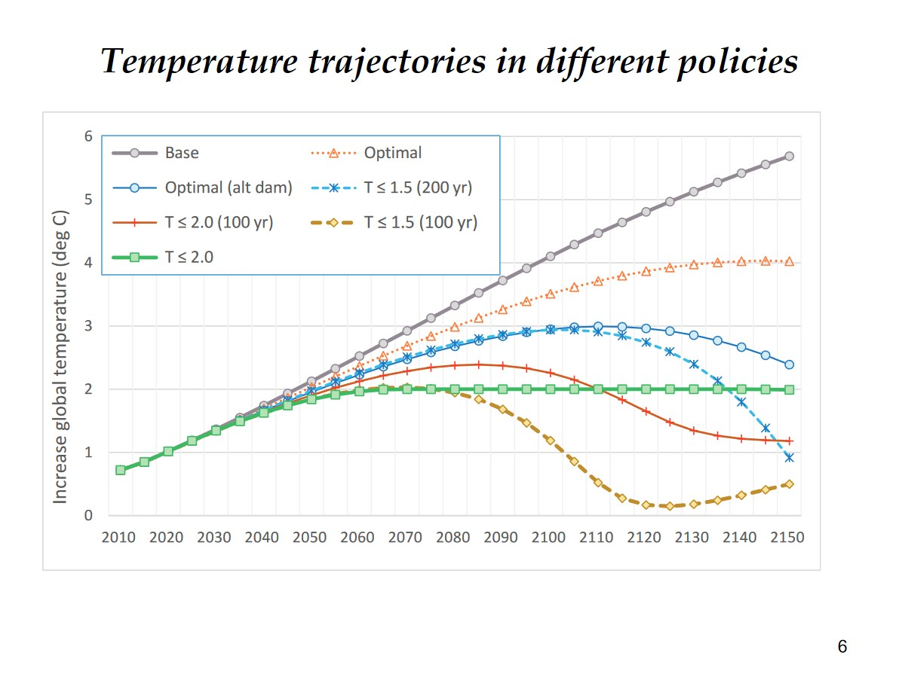
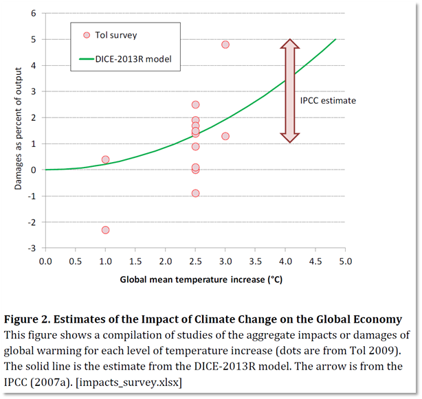

*Die hier dargestellte Meinung entstand vor allem in Vorbereitung und Auseinandersetzung mit Professor Pies von der MLU Halle. Ich hatte ihn in der Vorlesung für die alleinstehende These von Nordhaus kritisiert, woraufhin er mich zu einem Einzelgespräch einlud.*

## Die 4-Grad These

> The optimal scenario for climate change policies results in 4° global warming
>
> *William Nordhaus*

Exzerpt aus der Nobelpreisvorlesung von William Nordhaus

***Beim erstmaligen Lesen dieser Aussage*** konnte ich meinen Augen kaum trauen. Es würde doch sicher niemand ernsthaft behaupten, dass dieses Szenario dass für die Menschheit optimale ist. Wo wir uns doch mit dem Vertrag von Paris 2015 darauf geeinigt haben, die globale Erwärmung auf 1,5° beziehungsweise 2° zu begrenzen. 

Doch diese Aussage stammt keineswegs aus dem Repertoire eines Öllobbyisten oder Klimawandelbeschwichtigers. Sie stammt von William Nordhaus, dem profiliertesten Klimaökonomen, der für die Arbeit zu dieser Aussage 2018 den Nobelpreis der Wirtschaftswissenschaften erhielt. 

Wie entsteht dieser extreme Widerspruch zu aktuellen politischen Zielsetzungen? Um diese Frage zu beantworten, muss man in die Tiefen der klimaökonomischen Modelle einsteigen, der sogenannten _Impact-Assessment-Modelle_ (IAM), zu deutsch _Folgenabschätzungsmodelle_.

## Impact-Assessment-Modelle und ihre Tücken

Ein IAM ist ein mathematisches, formalisiertes Verfahren zur Bewertung der wirtschaftlichen / sozialen / ökonomischen Folgen einer politischen Maßnahme. Das wohl bekannteste IAM der Klimaökonomie ist das _Dynamic Integrated Climate-Economy_ Modell ([DICE](https://en.wikipedia.org/wiki/DICE_model)) von eben erwähntem William Nordhaus. Erstmals 1993 veröffentlicht und seitdem mehrfach verbessert, ist es inzwischen das Standardmodell der klimaökonomischen Forschung. 

Dieses Modell besteht im Wesentlichen aus 5 Elementen:
1. Emissionen bei einem "business as usual" Szenario
2. Projektion des Temperaturanstiegs aufgrund der Emissionen (klimatologischer Teil des Modells)
3. Projektion des wirtschaftlichen Schadens aufgrund der Klimawandelfolgen (**Damage Function**)
4. Schätzungen der Vermeidungskosten von Emissionen
5. Annahmen über die Zeitpräferenz zwischen heutiger Vermeidung und zukünftigen Vorteilen der Vermeidung (**Discount Rate**)

Die beiden wichtigsten Annahmen des Modells, die die extreme Aussage erklären, werde ich im Folgenden ausführen.

### Teil 1: Discount Rate

Die grundlegende Idee einer Discount Rate ist, dass uns zukünftiger Nutzen weniger wert is als heutiger Nutzen. Wenn ich dir bspw. 100€ heute oder 100€ in 10 Jahren anbieten würde, würdest du vermutlich ersteres nehmen. Du präferierst also deinen heutigen Wohlstand gegenüber dem Wohlstand deines zukünftigen Ichs.

Auf gesellschaftlicher Ebene ist es etwas anders, hier beschreibt die Rate, wie wir die Präferenzen der zukünftigen Generationen einschätzen und wieviel wir ihnen zugestehen wollen. Wir diskontieren ihr Wohlergehen gegen unseres und schauen, auf wieviel Wohlstand wir verzichten möchten, um ihnen eine lebenswerte Welt zu bereiten. Das ist also im Wesentlichen eine ethische Frage, und der moralische Ansatz wäre, der zukünftigen Generation die gleichen Möglichkeiten zuzustehen wie uns (und möglichst wenig zu diskontieren = niedrige Rate). 

Nordhaus hingegen setzt sie sehr hoch an (3% pro Jahr). Der Effekt davon ist, dass uns das Wohlergehen zukünftiger Generationen nicht wichtig ist, sodass wir heute lieber emittieren sollten, statt uns Kosten für die Vermeidung aufzubürden. 

### Teil 2: Damage Function

Eine weitere fragliche Annahme des DICE-Modells ist die Damage Function. Sie beschreibt die Auswirkungen, die erhöhte Temperaturen auf unsere Wirtschaft haben werden. Da dieser Zusammenhang unglaublich schwierig herzustellen ist, vereinfacht Nordhaus stark und behauptet, dass es einen quadratischen Zusammenhang gibt. Das sieht dann ungefähr so aus:

Ein Anstieg der Temperatur um 5° würde also unseren Wohlstand um gerade einmal 5% senken, und dass auch nur langfristig über die nächsten 100 Jahre, also aufs Jahr runtergerechnet quasi nichts. 

Das Problem der Annahme ist, dass Kipppunkte unseres Klimas in einer quadratischen Formel nicht vorkommen können. Und neuere wissenschaftliche Erkenntnisse bestätigen, dass ab spätestens 2,5 Grad unumkehrbare Effekte eintreten werden, die die Erwärmung weiter verstärken würden. Bei 4° oder auch 5° ist nur sicher, dass der gesamte grönlandische Eisschild abgeschmolzen sein wird und wir die meisten Küstenstädte wie New York verlagern müssen. Das dass gerade einmal 8,5% unserer Wirtschaftsleistung in Anspruch nehmen wird, ist eine maßlose Untertreibung.

Basierend auf diesen Annahmen (und noch vielen weiteren, auf die hier nicht eingegangen wird), kommt das DICE-Modell also zum Ergebnis, dass 4° Celsius die optimale Temperatur wäre. Wie wir gesehen haben, basierend auf willkürlichen Inputs und stark vereinfachenden Annahmen. Sollten wir also auf den Versuch verzichten, die Komplexität des menschengemachten Klimawandels in ein Modell zu pressen?

## Alternative: IPCC

***So demkt jedenfalls das*** _Intergovernmental Panel on Climate Change_ (IPCC), der führende Aggregator für wissenschaftliche Erkenntnisse zum Klimawandel. Der verzichtet seit 2015 auf die Modellierung der gesamtwirtschaftlichen Effekte, unter anderem wegen der schwierigen Monetarisierung von Folgen und der Nichtbeachtung von Kipppunkten in unserem Ökosystem. 

> Many estimates do not account for the possibility of large-scale singular events and irreversibility, tipping points and other important factors, especially those that are difficult to monetize, such as loss of biodiversity.
>
> *__IPCC__ Assessment Report 5, S. 79*

Inbesondere für spekulative Szenarien über 3° wird darauf hingewiesen, dass wir zu wenig wissen. Damit fällt Nordhaus' Prognose von optimalen 4° außerhalb des wissenschaftlichen Rahmens.

> Very little is known about the economic cost of warming above 3°C relative to the current temperature level.  (high confidence)

Und genau deswegen haben sich die Staaten der Welt darauf geeinigt, die Erderwärmung auf 1,5° zu begrenzen. Wir wissen, dass bereits jetzt dramatische Folgen des Klimawandels insbesondere ärmere Länder bedrohen und es potentielle Kipppunkte gibt, die alles noch verschlimmern könnten. Sollten wir uns also darauf verlassen, dass 4° die optimale Temperatur sind und wir einfach weitermachen können wie bisher?

> The Stakes Of Losing This DICE Game Are Enormous

## Was kann Klimaökonomik?

***Die Klimaökonomik sollte also sich weniger darauf konzentrieren***, große, komplexe Modelle mit stark vereinfachten Annahmen der schwierig zu beziffernden Folgen des Klimawandels zu berechnen. 

Es sollte sich stärker darauf konzentriert werden, mit welchen Instrumenten wir unsere gesteckten Ziele erreichen. Und da muss man Nordhaus trotz aller Kritik zugestehen, dass er einer der frühesten und prominentesten Verfechter einer konsequenten Besteuerung von Emissionen war, trotz eines zumeist zu niedrig angesetzten Preises. 

> The fact that the single most prominent orthodox economist [Nordhaus] in the world working on climate change considers the risks from  4°C of warming to be "optimal" tells us everything about the bankrupt state of orthodox economics.
> 
> _**Noam Chomsky**, Climate Crisis and the Global Green New Deal_

## Weiteres zum Thema

- [Nordhaus' originales Paper](https://www.jstor.org/stable/2880417)
- [seine Preisvorlesung für den Nobelpreis](https://www.youtube.com/watch?v=h1RkSuAs03Q)
- [Kritik vom heterodoxen Ökonom Steve Keen](https://evonomics.com/steve-keen-nordhaus-climate-change-economics/)
- [wissenschaftliche Kritik von Pindyck (LSE)](https://pubs.aeaweb.org/doi/10.1257/jel.51.3.860)

