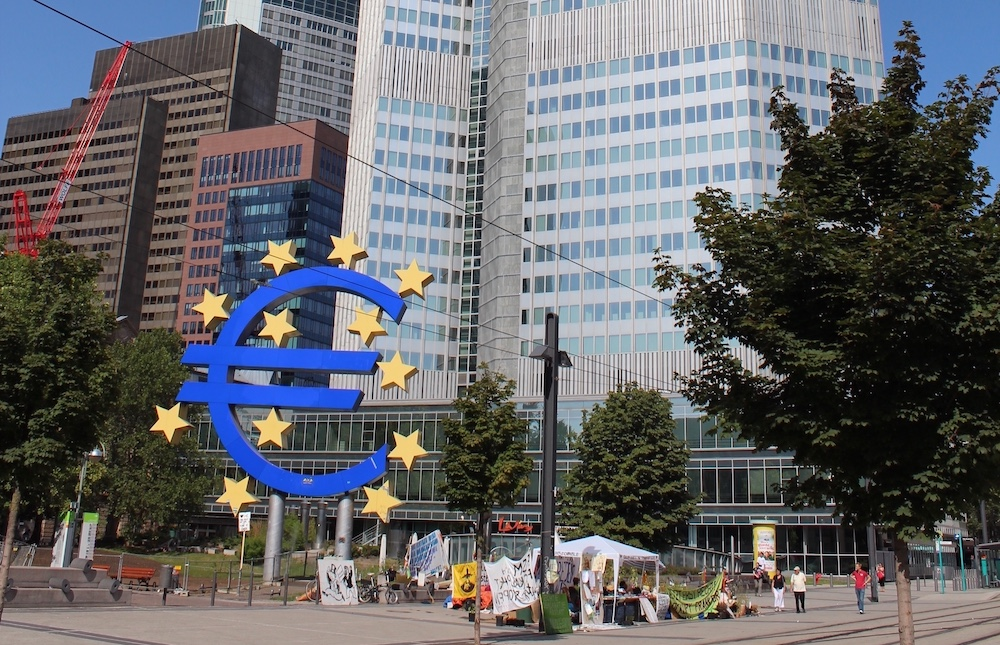

> Dieser Text stammt von Kilian von der Pluralen Ökonomik Halle und entstand im Kontext unseres Lesekreises zu Geldpolitik und Schattenbanken. Er wurde erstmals im [Transit-Magazin](https://transit-magazin.de/2022/05/krisen-machen-geld-wieder-politisch/) veröffentlicht

Als Annalena Baerbock am Morgen dieses erschütternden 24. Februars feststellte: „Wir sind heute in einer anderen Welt aufgewacht“, konnte man das noch vornehmlich auf die Verteidigungspolitik beziehen: Die angenommene Garantie für Frieden in Europa erwies sich als Illusion, der scheinbar unumstößliche Wille zur Abrüstung fing schon an zu schwanken. Einige Tage später aber stellen wir fest, dass auch die ökonomische Welt ein wenig aus den Angeln gehoben wurde. Wie schon in den großen Krisen der vergangenen 15 Jahre werden gerade in der Fiskal- und Geldpolitik unüberwindbar geglaubte Tabus gebrochen und scheinbar festgeschriebene Grenzen überschritten. Das geplante Sondervermögen für die Bundeswehr beispielsweise spottet der sonst so hochgehaltenen deutschen fiskalischen Disziplin.

Die Sanktionen gegen russische Banken wiederum zeigen, dass Geldpolitik nicht einfach nur eine technische Angelegenheit für Expert*innengremien ist, sondern mächtige politische Instrumente birgt. Die Krise zeigt wieder einmal: Unsere wirtschaftspolitischen Regeln sind nicht gottgegeben und festgeschrieben, sondern änderbar. Und gerade der innerhalb weniger Tage vollzogene Richtungswechsel hin zur Aufrüstung zeigt, dass wir anfangen müssen, über Fragen der Haushalts- und Geldpolitik wieder zu streiten. Wir sollten sie nicht nur ad hoc in Krisenzeiten ändern, sondern kontinuierlich überprüfen und durchdacht verbessern. Es gilt, Haushalts- und Geldpolitik zu repolitisieren.

## There are three things you don´t talk about: politics, religion and money

Wenn irgendetwas repolitisiert werden kann, muss es vorher entpolitisiert worden sein. Mit entpolitisieren meine ich: Eine Frage, die vorher öffentlich diskutiert und per direktem oder parlamentarischem Mehrheitsvotum entschieden wurde, von der Tagesordnung nehmen, beispielsweise indem man ihre Antwort in die Verfassung schreibt. So wie man halt bei Tisch nicht über Politik, Religion und Geld sprechen soll, haben auch wir uns entschieden, im öffentlichen Diskurs nicht mehr über bestimmte Zusammenhänge von Geld und Politik zu sprechen.

In der Geldpolitik steht dafür in Europa die Europäische Zentralbank: Ob der Leitzins angehoben wird oder nicht, und in welcher Menge die EZB Staatsanleihen kauft, darüber wird nicht von gewählten Vertreter*innen der europäischen Bevölkerung diskutiert. Vielmehr wurde in den Maastricht-Verträgen ein Ziel festgeschrieben: Preisstabilität, knapp unter 2% Inflation, heute genau 2%. Und dieses feste Ziel soll nun von der EZB als Expertengremium umgesetzt werden. Das hat durchaus seine Vorteile: Es kann keinen verrückten Politiker mehr geben, der immer kurz vor der Wahl den Leitzins senkt, um die Wirtschaft anzukurbeln und so kurzfristig sein Image aufzupolieren. Die langfristigen Folgen wären eine mögliche Inflation und dadurch schlechtere wirtschaftlichen Entwicklung. Das zu verhindern, ist löblich. Die Festschreibung hat aber auch Nachteile: So diskutieren wir nie darüber, ob uns nicht beispielsweise eine niedrige Arbeitslosenquote wichtiger ist als die Inflation unter 2% zu halten, und ob wir nicht den Leitzins eher an Überlegungen zur Arbeitslosigkeit ausrichten sollten.

Auch in der Fiskalpolitik wurde eine Frage dem Diskurs entzogen, nämlich die Frage nach dem richtigen Niveau und/oder Wachstum der Schulden – und damit indirekt auch der Größe des Haushalts. Mit der Schuldenbremse hat sich Deutschland per Verfassung darauf festgelegt, (fast) keine neuen Schulden aufzunehmen. Ähnliche Regeln gibt es auf der Ebene der EU. Auch dies hat Vorteile: Ein übermäßiger Schuldenstand könnte irgendwann dazu führen, dass wir große Mengen unseres Haushalts für die Schuldentilgung verwenden. Die Nachteile aber sind unübersehbar: Selbst, wenn wir bestimmte Investitionen für unsere Zukunft als sehr sinnvoll und lohnend erachten, brauchen wir eigentlich gar nicht erst anfangen, über sie zu reden. Denn die Schuldenbremse, gepaart mit fehlendem Willen zur erhöhten Besteuerung, schränkt unseren fiskalpolitischen Spielraum eng ein.

Wie die Religion den Menschen Halt geben kann, so kann auch die quasi-religiöse Anbetung der Schuldenbremse und der Unabhängigkeit der Zentralbank stabilisierend wirken. Manchmal aber erweisen sich unsere Glaubenssätze als unbrauchbar, und dann müssen wir über neue Lösungen reden.

## Ist Christus Lindner der Fiskal-Messias?

Dass die Regeln der Geld- und Fiskalpolitik tatsächlich von uns selbst gemacht und also auch wieder änderbar sind, ist in den letzten 15 Jahren besonders durch die großen Krisen immer wieder gezeigt worden.

Die Finanzkrise ab 2007 führte zu einem veränderten Verhalten der Zentralbanken: Sie fingen an, Staatsanleihen in großem Maßstab aufzukaufen. Da ihnen monetäre Staatsfinanzierung untersagt ist, bewegten sie sich damit am Rande ihres Mandats – am Rande der Spielregeln. Auch ihre Entscheidung, dem Markt nicht mehr nur noch über Geschäftsbanken, sondern auch über Akteure des sogenannten Schattenbankensystems Geld bereitzustellen, bedeutete ein Novum. Genauso wurde in der Covidkrise mehr Akteuren als vorher über die Zentralbank Geld bereitgestellt: Geldpolitik wurde hier neu und außerhalb der alten Regeln gedacht.

Auch der Klimawandel scheint bei der EZB angekommen zu sein. Sie denkt darüber nachdenkt, Investitionen in nachhaltige Anlagen zu priorisieren. Eine solche wirtschaftlich lenkende Rolle hatte sie vorher nicht eingenommen. Natürlich werden diese Kurswechsel der EZB nicht nur wohlwollend aufgenommen, sondern auch kritisiert. Aber immerhin: Wir reden darüber, was wir in Bezug auf Geldbereitstellung politisch wollen, und nehmen nicht einfach nur an, dass die alten Regeln schon dem Konsens entsprechen. Zuletzt verschiebt auch die aktuellste Krise, der russische Angriff auf die Ukraine, monetäre Paradigmen: Die wichtigsten Sanktionen gegen Putins Russland sind geldpolitischer Art. Russische Banken werden vom Zahlungssystem Swift ausgeschlossen, was die Möglichkeit internationalen Handels für Russland mit den sanktionierenden Ländern stark reduziert, weil fast kein Geld mehr nach Russland fließen kann. Und der russischen Zentralbank wird durch Einfrieren ihrer im Ausland gehaltenen Devisenreserven die Möglichkeit genommen, den Rubelkurs durch Aufkaufen von Rubel zu stützen.

Die Antworten auf Klimawandel, Pandemie und den russischen Angriff kratzen aber nicht nur an den bisherigen Strukturen der Geld-, sondern auch der Haushaltspolitik. So wurde für 2020 bis 2022 die Schuldenbremse ausgesetzt, um die gesundheitlichen und wirtschaftlichen Folgen der Pandemie abzufedern. Und Teile der Mittel, die unter Aussetzung der Schuldenbremse im vergangenen Jahr für die Covidkrise bereitgestellt wurden, sollen nun für Investitionen für den Klimaschutz umgewidmet werden. Das muss man sich erst einmal vorstellen: Fiskalfalke Christian Lindner sucht nach Wegen, die Schuldenbremse zu umgehen. Und wie schon bei Pandemie und Klimawandel wird auch in Reaktion auf die Russland-Ukraine-Krise die wohl schon etwas ausgeleierte Schuldenbremse links (oder rechts) liegen gelassen. Olaf Scholz kündigte kürzlich an, per Sondervermögen, also vorbei an der Schuldenbremse, die Wiederaufrüstung der Bundeswehr zu ermöglichen.

Und hier offenbart sich das Problem: Wir verlassen uns in „normalen“ Zeiten auf festgeschriebene Regeln. Erst in Krisenfällen werden diese Regeln, wie die Schuldenbremse oder eine vorgestellte Neutralität der Zentralbanken, dann gebrochen, weil man erkennt, dass sie möglicherweise nicht so gut funktionieren, wie man angenommen hatte. Die Änderung in Krisenzeiten aber hat oft einen administrativen und nicht politischen Charakter. Es wird nicht groß diskutiert, sondern durchregiert. Das kann dann manchmal gut gehen – Stichwort Nachtragshaushalt für Klimainvestitionen – und manchmal aber auch eine bedenkliche Richtung nehmen – Stichwort Aufrüstungswettbewerb. Die Lehre, die wir ziehen müssen, ist Folgende: Lasst uns anfangen, Regeln als das zu erkennen, was sie sind – menschengemacht, änderbar und also diskussionswürdig. We gotta talk about money.

## Was nun?

Es gibt die zynische Formel, dass man Krisen auch als eine Chance begreifen kann. Die Russland-Ukraine-Krise ist keine Chance, sie ist eine Katastrophe, nichts anderes. Putins Angriff löst schon nach wenigen Tagen unvorstellbar viel Leid aus. Wir werden aber aus dieser Situation Erkenntnisse ziehen müssen, und das galt auch schon für die anderen Krisen der 2000er und 2010er Jahre. Wir sollten die Krisenpolitik betrachten und an ihr aufzeigen, dass wir zwar innerhalb eines Sets von Regeln leben, diese Regeln aber selbst geschaffen haben und also auch wieder verändern können. Während wir in der Geldpolitik noch weit von einer tatsächlichen Repolitisierung entfernt sind, muss anhand der Russland-Ukraine-Krise dem öffentlichen Bewusstsein klargemacht werden: Sieh doch hin, Geld ist politisch. In der Fiskalpolitik aber deutet sich an, dass die Politik tatsächlich lernfähig ist. Während wir derzeit noch offiziell an der Schuldenbremse festhalten, wird de facto schon versucht, sie zu umgehen. Es ist nicht auszuschließen, dass nach einer Periode der Quasi-Aussetzung der Schwarzen Null bei genügend Parlamentarier*innen durchsickert, dass das alles auch sein Gutes hat, und dass in der Folge auch eine formale Abschaffung der Schuldenbremse wieder auf die Tagesordnung kommen könnte.