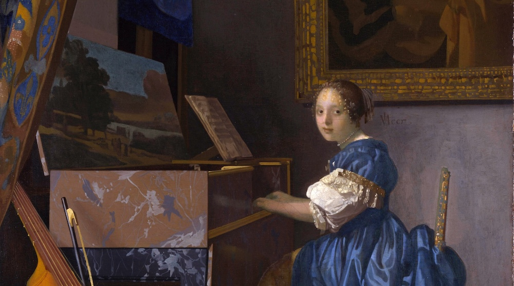

::: {.content-block}

# Colophon

{fig-alt="Vermeer: Lady Seated at a Virginal"}
:::

> In publishing, a colophon is a brief statement containing information about the publication of a book such as an "imprint" (the place of publication, the publisher, and the date of publication). 
>
> [*Wikipedia*](https://en.wikipedia.org/wiki/Colophon_(publishing))

This website is built on top of [Quarto](https://quarto.org), a modern system to create Websites, Articles, PDFs or Presentations from [Markdown](https://de.wikipedia.org/wiki/Markdown). The style is a customized version of the [Pressmark theme](https://mdwm.org/quarto-pressmark/), with colors inspired by the Financial Times.

The complete code as well as content for the website can be found on [GitHub](https://github.com/skriptum/quarto_site). I have added some extra tricks, but in the end its just some markdown files combined with graphic design (inspired by the FT btw). 

The serif font is [Playfair Display](https://fonts.google.com/specimen/Playfair+Display) (including its Smallcaps version), paired with the beautiful [Josefin Sans](https://fonts.google.com/specimen/Josefin+Sans).

Some SEO tricks are taken from the must-read [Guide to Academic Websites by Hendrik Erz](https://www.hendrik-erz.de/resources#academic-website). 
