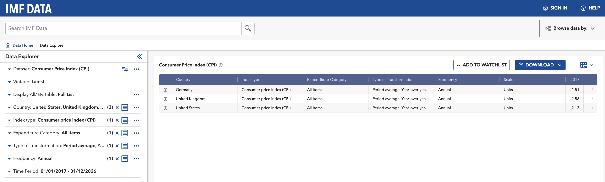
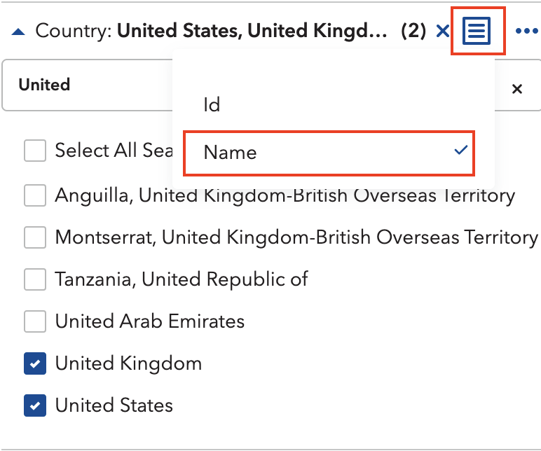
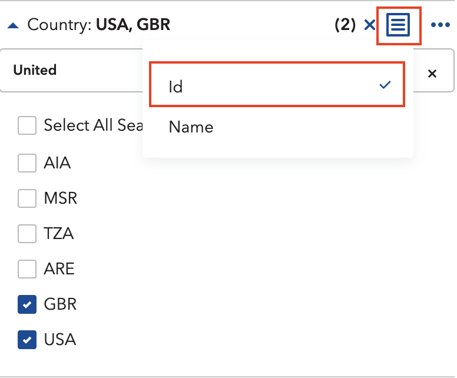
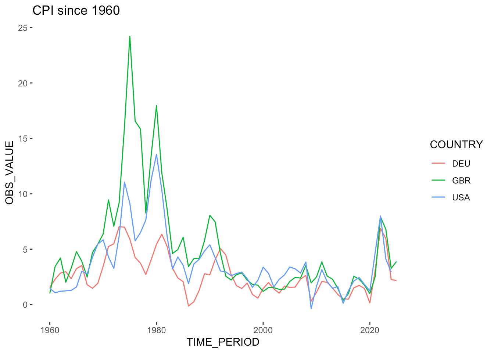

)](UN7670766.jpg)

## Preface

During my internship at the United Nations, I worked closely with the team behind the World Economic Forecasting Model (WEFM), the central model used for macroeconomic forecasting at the UN. [^1]

[^1]: The model is written in EViews and extremely complex, with hundreds of variables and matrices linking individual country models. Take a look [here](https://www.un.org/development/desa/dpad/wp-content/uploads/sites/45/publication/2016_Apr_WorldEconomicForecastingModel.pdf), if you're interested

The model fed on datasets from a dozen international organisations, among them IMF International Financial Statistics (now discontinued), each requiring careful transformation before the WEFM would accept them. Before I arrived, gathering all this data was largely a manual affair. Someone on the team would dutifully visit each organisation's website, click through whatever interface stood between them and the numbers, then download, clean, and wrangle the results into shape.

Now, thanks to a new data pipeline developed in R, it's much quicker, less error-prone, and less of a hassle (anyone who's ever had to click through online databases to find that one Excel dataset knows how annoying it can be). The pipeline automatically accesses the organisations' databases and processes the data. All thanks to the magic of ✨ SDMX APIs ✨. And because documentation on using SDMX and R is incredibly sparse, here is the guide I wished had existed.

> If you want to learn more about the pipeline itself, take a look at the [GitHub Repository](https://github.com/skriptum/WESP-Pipeline). It goes into further detail on how it works. Be reminded that it is quite specific code for the United Nations WEFM, so it may be of limited use to others.

## What's SDMX?!

In short: Statistical Data and Metadata eXchange ([wiki](https://en.wikipedia.org/wiki/SDMX)). Bear with me here, I know it sounds extremely dull at first, but it's really quite a magical feat of engineering. With SDMX, anyone can access statistical – as the name hints at – from a lot of different organisations (BIS, IMF, WB, OECD, the list goes on...) trough one unified API.

It does far more than just serving downloads. Uploading, managing, cataloguing, the full 145-page [user guide](https://sdmx.org/wp-content/uploads/SDMX_2-1_User_Guide_draft_0-1.pdf) is a testament to how much territory it covers. For our purposes, though, none of that matters. We just want data!

A basic API Call needs 3 identifiers to download requested data:

1. The statistical agency you want data from (e.g IMF), called a _Provider_ in SDMX Lingo
2. The name of the database you want to access (the _Dataflow_)
3. Specific columns / groupings (the _Dimensions_), e.g
   - only some Countries
   - a certain Time Period
   - etc.
   - *these dimensions differ for each dataset, so you need to adjust your call*

You just need to chain all of these together, et voila: your dataset. This sounds easier than it is, because most organisations dont document their APIs in an accessible manner, and because every database has slightly different names for their dimensions. 

That was quite abstract, so lets see some real data.

## A practical example: IMF Inflation data

Imagine we want to download Consumer Price Index (CPI) data for the US, UK and Germany. 

We start on [IMF data website](https://data.imf.org/en), search for CPI and land on the [CPI dataset](https://data.imf.org/en/datasets/IMF.STA:CPI). Then, we first take a quick look at it and open the [Data Explorer](https://data.imf.org/en/Data-Explorer?datasetUrn=IMF.STA:CPI(5.0.0)) (the button titled View Data):



On the left panel, select the three countries, set the index to All Items, and ask for the year-on-year percentage change. On the right, you should now see the data series for Germany, UK and the US.

Okay, so we know the _Agency_ (IMF), the Dataset / _Dataflow_ (CPI) and the specific selection / _Dimensions_ (Country, Category etc.). Now, the remaining task is finding what these things are actually called inside the database, because the human-readable labels and the underlying IDs are entirely different creatures.

The fix is simple: in the Data Explorer, click the small icon beside each dimension and switch the display to ID. Germany stops being Germany and becomes DEU. The United Kingdom becomes GBR. And so on.

::: {layout-ncol="2"}





:::


For all dimensions, this will look something like this:

| Dimension              | Name                                     | ID            |
| ---------------------- | ---------------------------------------- | ------------- |
| Country                | United Stations, United Kingdom, Germany | USA, GBR, DEU |
| Index Type             | Consumer Price Index                     | CPI           |
| Expenditure            | All Items                                | _T            |
| Type of Transformation | Period average, Y-O-Y percentage change  | YOY_PCH_PA_PT |
| Frequency              | Annual                                   | A             |

Now we have everything to get started in R.

## R you ready?

First, lets import the relevant libraries. We will use the [rsdmx](https://github.com/eblondel/rsdmx/wiki) library, so install it if you haven't already.

```r
# install.packages("rsdmx") # if you havent already
library(tidyverse) # the one and only
library(rsdmx)     # the workhorse library
```

Next, we assemble our key by stringing the dimension IDs together. Think of it as writing the address on an envelope: get one part wrong and nothing arrives.
```r
COUNTRIES <- "USA+GBR+DEU" # The countries we selected
INDICATOR <- "CPI" # Consumer Price Index
EXPENDITURE <- "_T" # All items / Total
TRANSFORMATION <- "YOY_PCH_PA_PT" # Percentage change YOY
FREQUENCY <- "A" # Annual

key <- paste0(COUNTRIES, ".", INDICATOR,".", EXPENDITURE, ".", TRANSFORMATION, ".", FREQUENCY)
```

With our key in hand, we call the API, specifying our provider, database, and (optionally) a time period:

```r
raw_data <- readSDMX(
  providerId = "IMF_DATA",  # IMF as Provider
  resource = "data",        # we want data
  flowRef = "CPI",          # from the CPI database
  key = key,                # with our carefully created key
  start = 1960,             # lets limit it to start in 1960
  )
```

The response is in SDMX format, so we have to convert it to a data frame first.

```r
df <- as.data.frame(raw_data)
```

Let's make a quick plot:

```r
df %>%
  select(COUNTRY, TIME_PERIOD, OBS_VALUE) %>%   # select relevant columns
  mutate(                                       # change types of columns
    OBS_VALUE = as.numeric(OBS_VALUE),
    TIME_PERIOD = as.numeric(TIME_PERIOD)
    ) %>%  
  ggplot(aes(x=TIME_PERIOD, y=OBS_VALUE, color=COUNTRY)) +     # basic ggplot call
    geom_line() +                               # present as line plot
    labs(title="CPI since 1960")                # add title
```



There you have it, this is how you get any IMF dataset into R. 

## Appendix 

Most major statistical institutions speak SDMX, and `rsdmx` can talk to all of them. Some make life easier than others. The OECD, for instance, is positively generous about it: navigate to any dataset, make your selection, and hit "Developer API." It hands you the query string ready-made, and you can drop it straight into `readSDMX` without touching a dimension ID. Would be great if all of them made it that easy (looking at you, ECB :).

