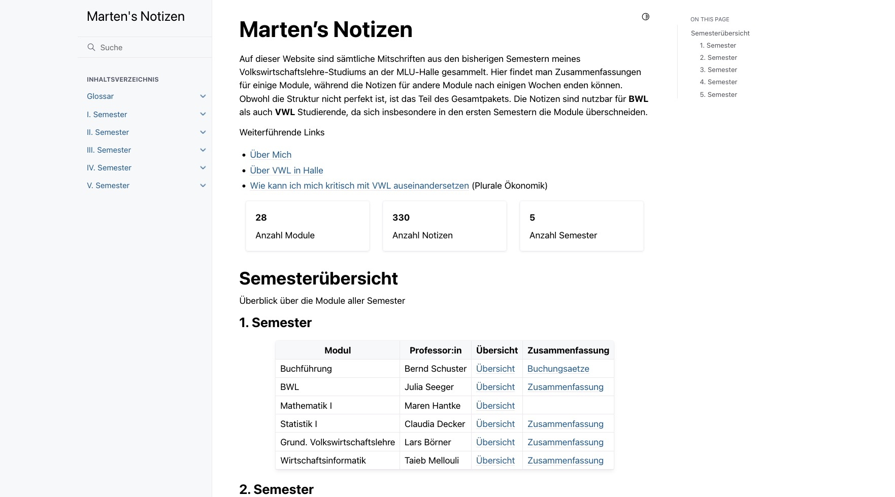

> Go to [***vwl.martenw.com***](https://vwl.martenw.com) to take a look

***When you stumble into your first semester at university***, chances are you’ll feel completely overwhelmed. Suddenly there are lectures, tutorials, readings, deadlines, and about a dozen different expectations no one really explained beforehand.

To make that process a little less chaotic, I decided to publish all of my notes from my entire Economics & Business Administration (VWL/BWL) bachelor’s degree at MLU Halle as a website at: [vwl.martenw.com](https://vwl.martenw.com).

The site contains notes from 30 modules and more than 300 individual lecture write-ups, all organized by date and fully searchable. Think of it as a slightly more structured external hard drive for my bachelor’s brain.

It ended up being surprisingly useful for my classmates and me—especially when exam season rolled around. There are summaries for almost all modules on there, as well as the course papers I submitted.

Under the hood, everything is built from the Markdown files I originally used to take notes during class (including LaTeX formulas). The whole thing is compiled into a website using Sphinx, turning a pile of lecture notes into something that’s actually navigable.

If you’re curious about how it works, you can check out the GitHub repository [here](https://github.com/skriptum/vwl).
