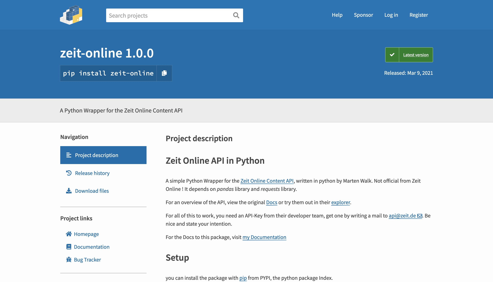

- [Dokumentation](https://skriptum.github.io/zeit/)
- [Package auf PYPI](https://pypi.org/project/zeit-online/)
- [Code auf GitHub](https://github.com/skriptum/zeit)

Die ZEIT ist als eine der ältesten und wichtigsten Zeitungen Deutschlands ein wahrer Schatz an Informationen, sei es über die Themen vergangener Zeiten, die politischen Interessen der Bundesrepublik oder einfach die Wichtigkeit aktueller Themen. Jeder und jede kann nun auf diesen großen Datenschatz zugreifen, und seine ganz eigenen Ideen daraus entwickeln, mithilfe des zeit-online packets in der einfachen Programmiersprache python.

## Technisches

> **Update 2022**: Leider hat Zeit Online die API inzwischen abgestellt, das Ganze ist also nur noch eine technische Spielerei der Vergangenheit

Die API ist zwar schon ein bisschen älter, funktioniert aber noch herausragend. Darum habe ich ein Package geschrieben, um die Interaktion damit zu vereinfachen und meine Skills auszutesten. Das Ganze ist auf PYPI als Package veröffentlich und die Dokumentation ist [hier](https://skriptum.github.io/zeit/) einsehbar, inklusive Jupyter Notebooks und vielen Erklärungen.

### Ausprobieren

Um das ganze auszuprobieren, am besten das Package von pip installieren

``` python
pip install zeit-online
```

und dann in eine Datei importieren und die API Klasse initiieren und den API Key einfügen

``` python
import zeit
api = zeit.API()
api.set_token("API-KEY") #Key einfügen
#jetzt steht dir die Welt von Zeit Online offen
```

für ausführlichere Erklärungen, definitiv die [Dokumentation](https://skriptum.github.io/zeit/) angucken !
