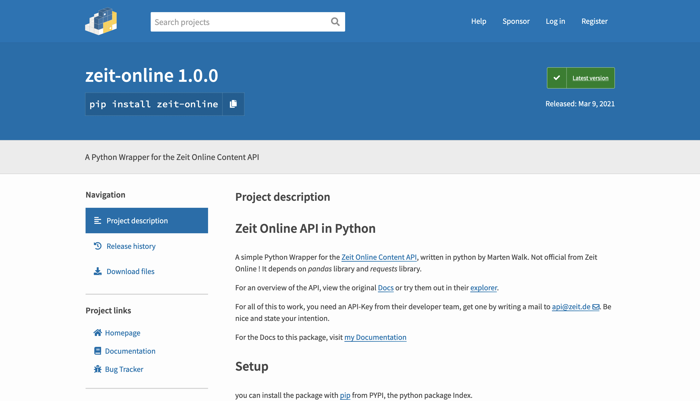

DIE ZEIT is one of the oldest and most influential newspapers in Germany. Over more than seven decades it has built a vast archive of articles covering politics, culture, science, and society. This archive is not only a historical record of events, but also a reflection of how public debates, political priorities, and social issues evolve over time.

The **zeit-online** Python package makes it possible to explore this archive programmatically. With only a few lines of code, anyone can access articles from different decades and experiment with their own ideas for analyzing journalism and historical trends. Whether the goal is simple exploration, building datasets, or experimenting with text analysis, the archive provides a fascinating dataset that captures more than 75 years of reporting.

The project was originally created as a small technical experiment. The underlying ZEIT Online API already exists, but interacting with it directly can be cumbersome. This package wraps the API in a simple Python interface and makes it easier to query articles, search the archive, and work with the results in code. At the same time, it serves as a practical way to experiment with building and publishing a Python library.

> **Update (2022):** ZEIT Online has since discontinued the public API. The package therefore no longer works for retrieving new data, but the project remains available as a demonstration of how the API could be used and how such a wrapper library can be built.

### Getting started

To try the package, install it using pip:

```python
pip install zeit-online
```

Then import the library and initialize the API client with your API key:

```python
import zeit

api = zeit.API()
api.set_token("API-KEY")  # insert your API key here
```
You can quickly check that the connection works using a simple status method:

```python
api.get_status()  # returns "everything ok" if the API is reachable
```

The most important method in the package is search_for, which allows you to search all available endpoints in the API for a given string. For example, searching for "Bundestag" in the default content endpoint returns a list of matching articles:

```python
api.search_for("Bundestag")  # returns a search class containing results
```

```
Search for 'Bundestag': 42942 results, limit: 10, matches : 
 
Koalition streicht Begriff "Rasse" aus dem Grundgesetz: http://api.zeit.de/content/1NRyOjRaneKYH6JRs87m46
Bund einigt sich mit AKW-Betreibern auf Entschädigung: http://api.zeit.de/content/5A6U2BpxAaU1YV6Yx9xPY4
"Das Gift ist da": http://api.zeit.de/content/3vrvroDbLrfwJ5VtigrEbh
Die Losbürger: http://api.zeit.de/content/7jM8ZQEFHYM0slSPyL3AN2
"Eine Weigerung hätte schmerzhafte Folgen für die Türkei": http://api.zeit.de/content/7h40VsJ5r2wNJgg6Msld8K
Der nächste Schock nimmt schon Anlauf: http://api.zeit.de/content/j4LDNEBKPGN1vjbOJKpxz
Für Störungen im Bundestag kann künftig Ordnungsgeld verhängt werden: http://api.zeit.de/content/2GOxLhUi8B48g2OziIZPCA
Von Storch und Pazderski wollen gemeinsam Berliner AfD führen: http://api.zeit.de/content/JB8hW8UFGRB9NZyY0TgMM
Bundestag hebt Immunität von CDU-Abgeordnetem Axel Fischer auf: http://api.zeit.de/content/tjB5SFOmwOmzGyZfOpZMq
Bundestag verlängert Rechtsgrundlage für Pandemie-Maßnahmen: http://api.zeit.de/content/3eGseNLQSwHjA3SHwq22hP
```

On a given day, such a search might return tens of thousands of results. For example, the top matches today (March 2021) include articles like "Koalition streicht Begriff 'Rasse' aus dem Grundgesetz" or "Bund einigt sich mit AKW-Betreibern auf Entschädigung", each with a link to its original content.

Once you select a specific article from the search results, you can retrieve it using the get_article method. This returns an Article object, which provides access to various properties and methods:

```python
Article = api.get_article("1NRyOjRaneKYH6JRs87m46")  # can use full URI or just the ID
print(Article)
```

```
Article with title 'Koalition streicht Begriff "Rasse" aus dem Grundgesetz' 
UUID: 1NRyOjRaneKYH6JRs87m46, 
URI: http://api.zeit.de/content/1NRyOjRaneKYH6JRs87m46        
teaser_text: 'Die Bundesregierung hat sich auf eine Änderung des Grundgesetzes verständigt: Innen- und Justizministerium einigten sich darauf, wie das Wort "Rasse" ersetzt werden soll.'
```

The output shows basic information about the article, including its title, unique ID, URI, and teaser text. You can then access different attributes, like the supertitle, full title, and teaser text:

```python
print(Article.supertitle)  # prints the supertitle
print(Article.title)        # prints the title
print(Article.text)         # prints the teaser text
```

For example, a returned article might look like this:

```
Verfassungsänderung
Koalition streicht Begriff "Rasse" aus dem Grundgesetz
Die Bundesregierung hat sich auf eine Änderung des Grundgesetzes verständigt: Innen- und Justizministerium einigten sich darauf, wie das Wort "Rasse" ersetzt werden soll.
```

The package also allows you to retrieve keywords linked to the article, which can help with analysis, categorization, or further exploration:

```python
Article.get_keywords()
```

```
{'http://api.zeit.de/keyword/grundgesetz': 'Grundgesetz',
 'http://api.zeit.de/keyword/rassismus': 'Rassismus',
 'http://api.zeit.de/keyword/diskriminierung': 'Diskriminierung',
 'http://api.zeit.de/keyword/justizministerium': 'Justizministerium',
 'http://api.zeit.de/keyword/horst-seehofer': 'Horst Seehofer',
 'http://api.zeit.de/keyword/berlin': 'Berlin',
 'http://api.zeit.de/keyword/alexanderplatz': 'Alexanderplatz',
 'http://api.zeit.de/keyword/usa': 'USA',
 'http://api.zeit.de/keyword/bundesregierung': 'Bundesregierung',
 'http://api.zeit.de/keyword/csu': 'CSU',
 'http://api.zeit.de/keyword/bundestag': 'Bundestag'}
```

Take a look at the [GitHub repository](https://github.com/skriptum/zeit/) and the documentation for more details on how to use the package.