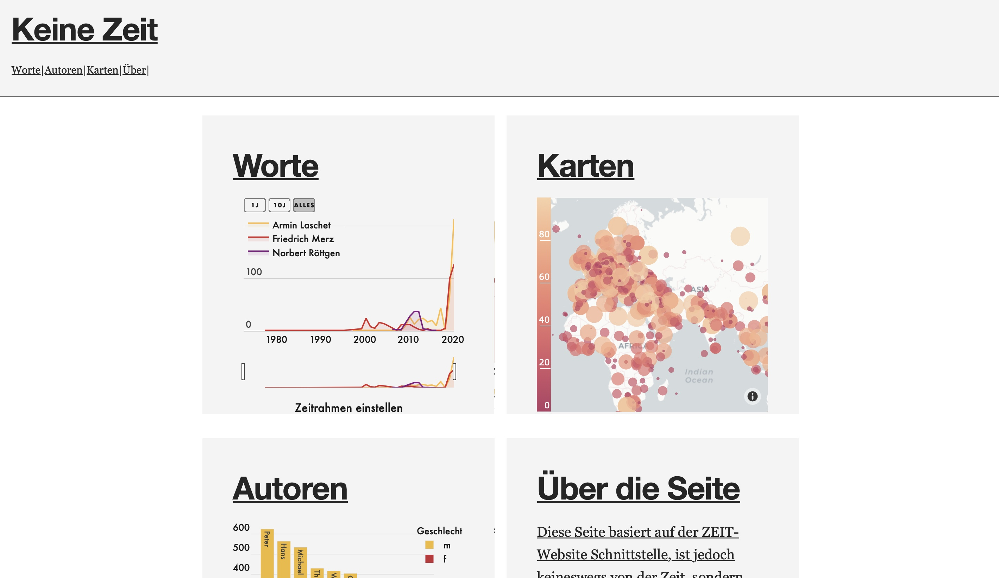
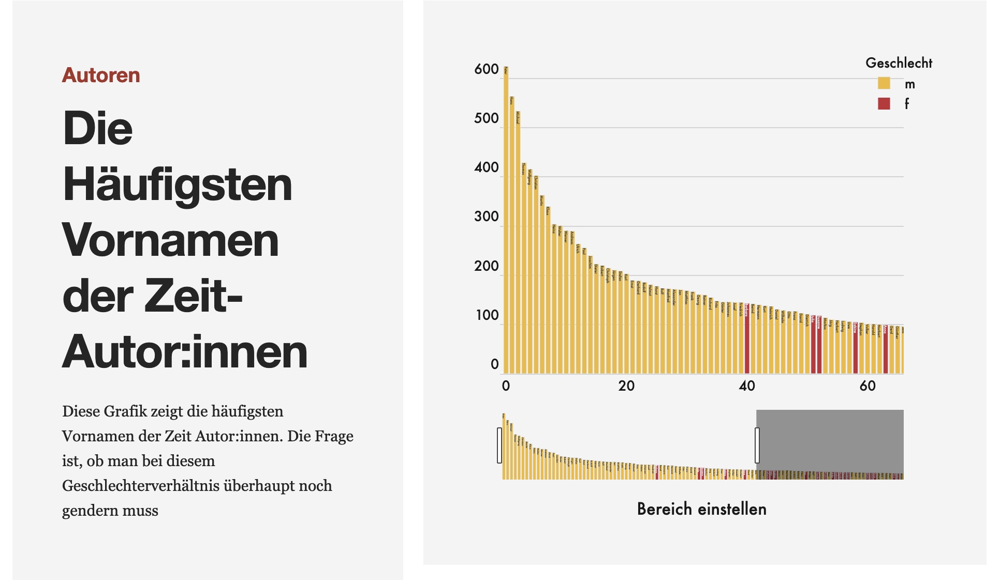
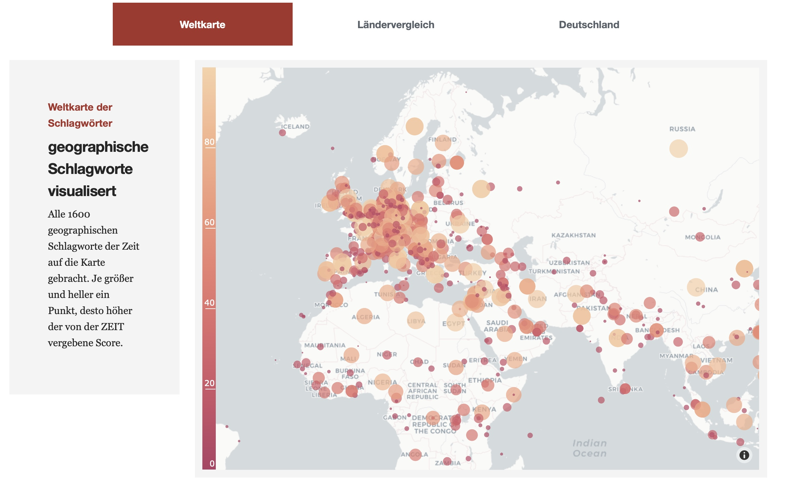
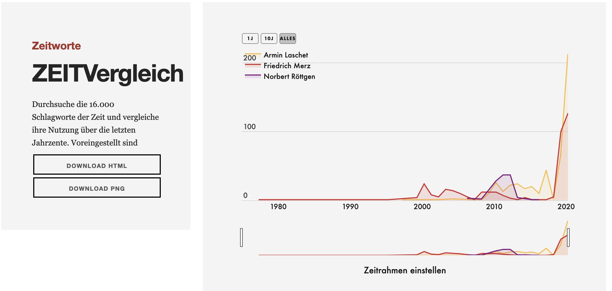

Die Website greift mithilfe des python-Moduls der Zeit API auf die Daten zu und bereitet sie visuell auf. Das ganze wird in 3 verschiedenen Themen interaktiv dargestellt. 

## Geschlecht der Autor:innen

So beispielsweise bei den häufigsten Vornamen der Zeit-Autor:innen, die vornehmlich männlich sind. Erst auf Platz 40 kommt ein weblicher Vorname erstmals auf (Barbara). 

## Geografischer Fokus der Artikel

Ebenso werden die geografischen Schlagworte der Zeit kartografiert. Die transatlantische Verankerung der Zeit ist hier stark zu erkennen, ebenso eine immense Ignoranz gegenüber dem afrikanischen Kontext (ein gesamtmediales Phänomen).

## Stichwortvergleich

Die Zeit hat etwa 16.000 Schlagwörter, mit denen sie Artikel versehen, gesammelt über einen Zeitraum von 75 Jahren. Mit dieser Seite ist es möglich, die Relevanz verschiedener Themen über die Jahre zu vergleichen, ähnlich zu Google Trends.

> **Update 2022**: Aufgrund des Abstellens der Zeit-API von Verlagsseite aus ist die Funktionsweise der App leider nicht mehr möglich.

